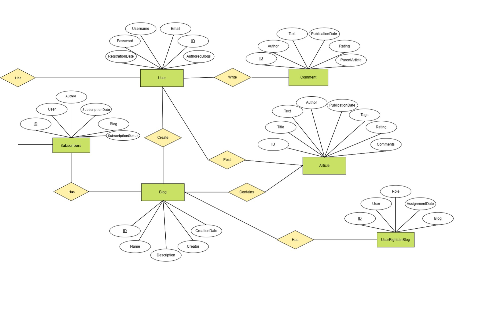

# Lab 1

### Состав команды

- Андреев Кирилл Николаевич
- Нестеренко Ольга Юрьевна
- Соловьева Полина Александровна
- Габов Михаил Дмитриевич
- Белов Григорий Павлович

Команда №27

### Тема

Сайт для просмотра/создания статей для habr

## Entities

### Пользователь (User)

- `ID`: Уникальный идентификатор пользователя
- `Имя пользователя`: Логин пользователя
- `Email`: Электронная почта пользователя
- `Пароль`: Зашифрованный пароль
- `Дата регистрации`: Дата создания аккаунта
- `Роль`: Роль пользователя (обычный пользователь, модератор, администратор)
- `Список блогов`: Блоги, в которых пользователь является автором

### Статья (Article)

- `ID`: Уникальный идентификатор статьи
- `Заголовок`: Название статьи
- `Текст`: Содержимое статьи
- `Автор`: Пользователь, создавший статью
- `Дата публикации`: Дата размещения статьи
- `Теги`: Ключевые слова, ассоциированные со статьей
- `Рейтинг`: Рейтинг статьи
- `Список комментариев`: Комментарии к статье

### Комментарий (Comment)

- `ID`: Уникальный идентификатор комментария
- `Текст`: Текст комментария
- `Автор`: Пользователь, написавший комментарий
- `Дата публикации`: Дата создания комментария
- `Рейтинг`: Рейтинг комментария
- `Ссылка на статью`: Статья, к которой относится комментарий

### Блог (Blog)

- `ID`: Уникальный идентификатор блога
- `Название`: Название блога
- `Описание`: Краткое описание блога
- `Создатель`: Пользователь, создавший блог
- `Дата создания`: Дата создания блога
- `Список статей`: Статьи, опубликованные в блоге

### Права пользователя в блоге (UserRightsInBlog)

- `ID`: Уникальный идентификатор записи прав
- `Пользователь`: Пользователь, которому присвоены права
- `Блог`: Блог, в котором присвоены права
- `Роль`: Роль пользователя в блоге (читатель, редактор, создатель)
- `Дата присвоения прав`: Дата назначения прав

## Методы работы приложения

### Регистрация пользователя

- **Тип запроса**: `POST`
- **URL**: `/api/users`
- **Request**:
  ```json
  {
    "username": "example_user",
    "email": "user@example.com",
    "password": "secure_password"
  }
  ```
- **Response**:
  ```json
  {
    "message": "Регистрация успешна",
    "user": {
      "id": 1,
      "username": "example_user",
      "email": "user@example.com",
      "role": "user"
    }
  }
  ```

### Аутентификация пользователя

- **Тип запроса**: `POST`
- **URL**: `/api/auth/login`
- **Request**:
  ```json
  {
    "email": "user@example.com",
    "password": "secure_password"
  }
  ```
- **Response**:
  ```json
  {
    "message": "Authentication successful",
    "token": "jwt_token_here"
  }
  ```

### Создание блога

- **Тип запроса**: `POST`
- **URL**: `/api/blogs`
- **Request** (токен аутентификации должен быть в заголовке запроса):
  ```json
  {
    "name": "Мой блог",
    "description": "Описание моего блога"
  }
  ```
- **Response**:
  ```json
  {
    "message": "Блог успешно создан",
    "blog": {
      "id": 1,
      "name": "Мой блог",
      "description": "Описание моего блога",
      "authorId": 1,
      "createdAt": "2024-02-25"
    }
  }
  ```

### Получение списка блогов

- **Тип запроса**: `GET`
- **URL**: `/api/blogs`
- **Response**:
  ```json
  {
    "blogs": [
      {
        "id": 1,
        "name": "Мой блог",
        "description": "Описание моего блога",
        "authorId": 1,
        "createdAt": "2024-02-25"
      }
    ]
  }
  ```

### Создание статьи

- **Тип запроса**: `POST`
- **URL**: `/api/articles`
- **Request** (Токен аутентификации должен быть в заголовке запроса):
  ```json
  {
    "title": "Название статьи",
    "text": "Содержимое статьи",
    "tags": ["Тег1", "Тег2"],
    "blogId": 1
  }
  ```
- **Response**:
  ```json
  {
    "message": "Article created successfully",
    "article": {
      "id": 1,
      "title": "Название статьи",
      "text": "Содержимое статьи",
      "authorId": 1,
      "createdAt": "2024-03-01",
      "tags": ["Тег1", "Тег2"],
      "rating": 0
    }
  }
  ```

### Удаление статьи

- **Тип запроса**: `DELETE`
- **URL**: `/api/articles/{article_id}`
- Аутентификация: Требуется JWT
- **Response**:
  ```json
  {
    "message": "Article deleted successfully"
  }
  ```

### Редактирование статьи

- **Тип запроса**: `PUT`
- **URL**: `/api/articles/{article_id}`
- **Request** (Токен аутентификации должен быть в заголовке запроса):
  ```json
  {
    "title": "Обновленное название статьи",
    "text": "Обновленное содержимое статьи",
    "tags": ["НовыйТег1", "НовыйТег2"]
  }
  ```
- **Response**:
  ```json
  {
    "message": "Article updated successfully",
    "article": {
      "id": 1,
      "title": "Обновленное название статьи",
      "text": "Обновленное содержимое статьи",
      "tags": ["НовыйТег1", "НовыйТег2"],
      "updatedAt": "2024-03-02"
    }
  }
  ```

### Создание комментария

- **Тип запроса**: `POST`
- **URL**: `/api/articles/{article_id}/comments`
- **Request** (Токен аутентификации должен быть в заголовке запроса):
  ```json
  {
    "text": "Текст комментария"
  }
  ```
- **Response**:
  ```json
  {
    "message": "Comment added successfully",
    "comment": {
      "id": 1,
      "text": "Текст комментария",
      "authorId": 1,
      "createdAt": "2024-03-02",
      "rating": 0
    }
  }
  ```

### Редактирование комментария

- **Тип запроса**: `PUT`
- **URL**: `/api/comments/{comment_id}`
- **Request** (Токен аутентификации должен быть в заголовке запроса):
  ```json
  {
    "text": "Обновленный текст комментария"
  }
  ```
- **Response**:
  ```json
  {
    "message": "Comment updated successfully",
    "comment": {
      "id": 1,
      "text": "Обновленный текст комментария",
      "updatedAt": "2024-03-03"
    }
  }
  ```

### ERD

